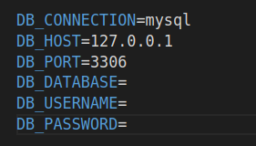

# Jobboard

# Lancer le serveur: Laravel
Si vous n'avez pas Composer installé sur votre ordinateur: suivez ce tutoriel: https://getcomposer.org/download/    
Placez vous dans le dossier step/backend puis lancez les commandes suivantes:  
```composer install```  
```cp .env.example .env```  
```php artisan key:generate ```  
Dans le fichier .env:   
Remplissez les champs ```DB_DATABASE``` ```DB_USERNAME``` ```DB_PASSWORD```  
(respectivement le nom de la base de données, le nom de l'utilisateur, et le mot de passe)  
  
Lancez ensuite la commande suivante pour générer des données dans votre base de données: ```php artisan migrate:fresh --seed```  
Vous pouvez maintenant lancer le serveur à l'aide de la commande:  
```php artisan serve```

# Lancer l'application: côté client React js
Placez vous dans le dossier step/jobboard puis lancez les commandes suivantes:  
```npm install```  
```npm install bootstrap```  
```npm install axios```  
```npm install react-router-dom```  
```npm i simple-react-validator```  
``` npm run start```  

# Identifiant administrateur
- email: admin1@mail.com
- mot de passe: bidule123


# Identifiant recruteur
- email:testrecruteur@mail.com
- mot de passe: bidule123

# identifiant rechercheur d'emploi
- email:rechercheur1@mail.com
- mot de passe: bidule123
